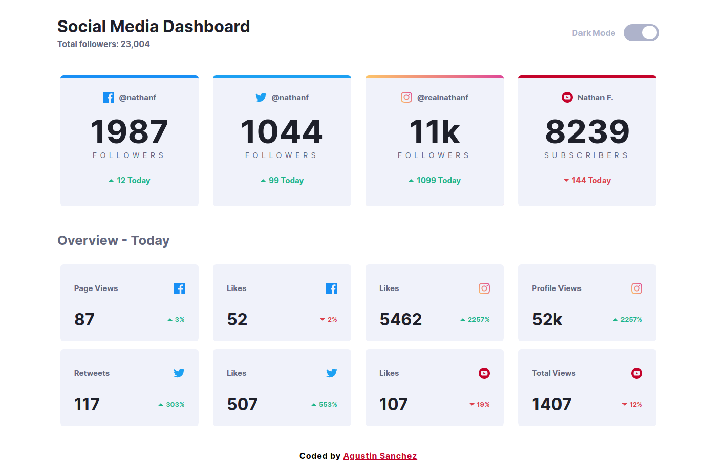
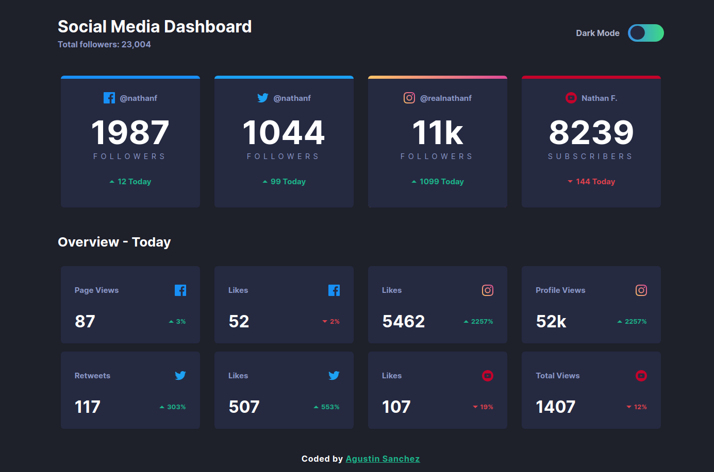
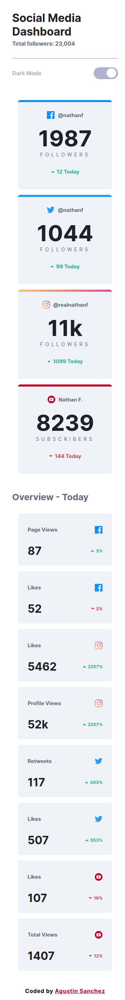

# Social media dashboard with theme switcher solution

This is a solution to the [Social media dashboard with theme switcher challenge on Frontend Mentor](https://www.frontendmentor.io/challenges/social-media-dashboard-with-theme-switcher-6oY8ozp_H). Frontend Mentor challenges help you improve your coding skills by building realistic projects. 

### The challenge

Users should be able to:

- View the optimal layout depending on their device's screen size
- See hover and focus states for interactive elements
- Toggle to dark theme with a button

### Screenshots

- Light theme

- Dark theme

- Mobile view

### Links

- [Fron End Mentor solution](https://www.frontendmentor.io/solutions/social-media-dashboard-with-theme-switcher-solution-react-s-xCu7FEjH)
- [Live site](https://social-media-dashboard-react-mu.vercel.app/)

### Built with

  
  
  

## Author

- Linkedin - [Agustin Emanuel Sanchez](https://www.linkedin.com/in/agustin-emanuel-sanchez-4b2807240/)
- Frontend Mentor - [@agusscript](https://www.frontendmentor.io/profile/agusscript)
- CodePen - [Agustin Sanchez](https://codepen.io/agusscript)
- Twitter - [@agus_script](https://twitter.com/agus_script)
